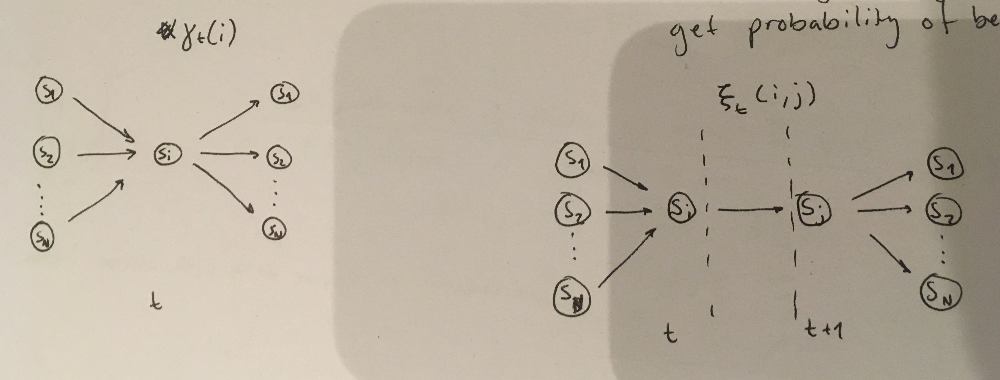

# testing hmm functions

start by importing our functions:

```python
import numpy as np
import os
os.chdir('/Users/foh/MEGAsync/phd/growing/hmm-master/shaping')
from itertools import product

# autoload functions
%load_ext autoreload
%autoreload 2

from hmm import setup_example, generate_observations
from hmm import alpha, beta, delta_and_psi_and_q, xi, gamma, lambda_step_update
from hmm import prob_of_obs_given_lambda
```

content based on youtube lecture series[^1]. that's in turn based on Rabiner (1989)[^2].


## example HMM

we use a simplified HMM, where each state can emit only one typ of observation. this makes it similar to shape sequence task.

> **question**: do any of the algorithms/functions break down because of this? do any of the mathematical definitions require that all states have a non-zero chance of emitting each possible observation?

attempt to answer: Rabiner's urn example (figure 3) is phrased like this shouldn't pose a problem, but it's not explicit.

our example model $\lambda$ consists of transition matrix $A$, observation function $B$ and initial probabilities $\pi$.

### model: $\lambda = (A, B, \pi)$

$N = 3$ states:
$$S = \{S_1, S_2, S_3\}$$

$$A= \{a_{ij}\} = \begin{bmatrix}
0.4 & 0.3 & 0.3 \\
0.2 & 0.6 & 0.2 \\
0.1 & 0.1 & 0.8
\end{bmatrix}$$

$M = 3$ observable symbols:

$$V = \{ v_1, v_2, v_3 \} = \{ red, green, blue \}$$

observation function:

$$B = \{b_j(k)\} = \begin{bmatrix}
1 & 0 & 0 \\
0 & 1 & 0 \\
0 & 0 & 1
\end{bmatrix}$$

where
$$b_j(k) = P(v_k \space at \space t | q_t = S_j)$$

and finally the initial probabilities:

$$\pi = \begin{bmatrix}1/3 & 1/3 & 1/3\end{bmatrix}$$

the model is hard codedly defined in the `setup_example` function:

```python
from hmm import setup_example

# return dictionary λ = {'A': A, 'B': B, 'π': π}
λ = setup_example()
```

we also need a way to generate data with this model, which we can do with the `generate_observations` function:

```python
from hmm import generate_observations

T = 10  # 10 timesteps
Q, O = generate_observations(λ, T)
```

where we have state sequence $Q=\{ q_1, q_2, .. , q_T\}$ and observations $O=\{o_1,o_2,..,o_T\}$.

each state $q_t \in S$ generates an observation from $B = \{b_j(k)\}$


## questions to ask about this HMM

we will attempt to answer three questions about our HMM:

- $P(O|\lambda)$ -- what’s the probability that model X generated sequence of observations?

- $P(Q | O)$ -- what sequence of states best explain the observations?

- $P(\lambda|O)$ -- how to learn the model probabilities that would generate the observations?


## likelihood: $P(O | \lambda)$ and $\alpha$ function

because how α works, the follwing is true:

$$P(O | \lambda) = \sum\limits_{i=1}^N \alpha_T(i)$$

we can thus get the likelihood of an observation sequence:

```python
from hmm import alpha

α = alpha(O, λ)
print(sum(alpha(O, λ)[-1]))  # last column is -1
```

we can confirm this result using the following mathematical relationship (details in Rabiner paper):

$$P(O | \lambda) = \sum_{allQ}P(O | Q, \lambda) P(Q|\lambda)$$

since all possible $Q$ quickly gets huge - $N^T$ combinations - we can't practically use this, which is why we have our $\alpha$ function, but we can test on very short sequences:

```python
from hmm import prob_of_obs_given_lambda

T = 5  # even with T=10 we get pretty long execution times
Q, O = generate_observations(λ, T)
print(prob_of_obs_given_lambda(O, λ))
print(sum(alpha(O, λ)[-1]))
```

great! it would be very unlikely we get the same exact results here if we made mistakes in any of the functions used. which means we can be reasonably secure believing alpha works as it should.


## beta function

the beta function goes backwards from time $T$ and is intuitively understood as similar to alpha just from the other direction. therefore it's an easy step to think you can sum over the first column of beta to get $P(O|\lambda)$ for the purpose of testing the output of our beta function:


```python
from hmm import beta

β = beta(O, λ)
print(sum(β[0]))
```

nope.

> **question** why doesn't this work for beta?

In Rabiner, the comments on equation 24 state that $\beta_T(i) = 1$ is chosen arbitrarily. So we have set $\beta_T(i) = 1/3$ (that's the case for the above result as well) - same as our $\pi$ - and that gives an interesting result:

```python
print(β[0])
print(sum(alpha(O, λ)[-1]))
```

notice that `β[0,1]` is the value we are looking for. that index happens to be the index of the state the true sequence was in at the same timestep $t=1$ (`t=0` in the code because python is zero indexed):

```python
print(Q)
```

Q uses 1-index for the states, so for example `q[0] = S2` is the value `β[0,1]`.

> **question** what's going on here? this feels unlikely to be a coincidence since it works every time, so what's up?

> **question** can we use this as indirect proof our beta function works?

## viterbi algorithm: $P(Q | O)$

viterbi uses the so called delta and psi functions (details in Rabiner paper):

```python
from hmm import delta_and_psi_and_q

δ, ψ, q = delta_and_psi_and_q(O, λ)
```

in short, $\delta$ contains probabilities of each state throughout our sequence based on the observations, so $\psi$ uses that to record the most probable state at each step.

therefore we get the final step by:

$$q^*_T=argmax_{1\leq j \leq N}[\delta_T(i)]$$

and to find the entire chain we go backwards from $q^*_T$:

$$
q^*_t=\psi_{t+1}(q^*_{t+1})
$$

the viterbi results are thus easy to check against the true state sequence $Q$:

```python
print(Q)
print(q)
```

## gamma and xi



- **$\gamma$** is the probability of being in $S_i$ at time $t$
    - we can get probability of *ever* being in $S_i$ by summing over all $t$
        - this is the expected number of times $S_i$ is visited
- **$\xi$** is the probability of transitioning from $S_i$ to $S_j$ at time $t$
    - sum over all $t$ to get probability of *ever* going from $S_i$ to $S_j$
        - expected number of times transit from $i$ to $j$

there's a nice relationship between these two:

$$\gamma_t(i) = \sum\limits_{j=1}^N \xi_t(i, j)$$

to test this in code:

```python
from hmm import xi, gamma

γ = gamma(O, λ, α, β)
ξ = xi(α, β, λ, O)
N = len(λ['B'])

for t, i in product(range(T-2), range(N)):  # T-1 without zero index
    ξsum = sum([ξ[t, i, j] for j in range(N)])
    print(f"for t, i: {t, i}")
    print(f"ξsum is {ξsum} and γ is {γ[t,i]}")
    print(f"equal? {γ[t, i] == ξsum}")
    print("::::::::::::::::::::::::::::::")
```

the times it's true is because we are using observation functions that have $p=0$ for observations.

> **question** why doesn't it work? we've tried using observation functions where we have small probabilities for all observations but that doesn't help. so there's an error somewhere..

> **question** can we check the output of $\gamma$ and $\xi$ separately? how?

## baum-welch: lambda update, $P(\lambda | O)$

given $\alpha, \beta, \gamma, \xi$, we can produce $\bar\lambda = (\bar A, \bar B, \bar \pi)$

to find (new) parameter values for our model based on observations we exploit the gamma and xi functions absed on the above mentioned properties:

- $\bar \pi = \gamma_1(i)$ - expected frequency in $S_i$ at time $t=1$

> **question** this seems like an arbitrary definition, like with $\beta_T(i) = 1$ above, no?

- $\bar A = \{\bar a_{ij}\} = \frac{\sum\limits_{t=1}^{T-1} \xi_t(i, j)}{\sum\limits_{t=1}^{T-1} \gamma_t(i)}$ - transition matrix

- $\bar B = \{ \bar b_j(k) \}, \space\space\space \bar b_j(k) = \frac{\sum\limits_{t=1}^T \gamma_t(j)}{\sum\limits_{t=1}^T \gamma_t(j)}$ - observation function (1)

note than in nominator of (1) we only select those cases in state $j$ where we observe $v_k$, which is divided by the total timesteps we are in state $j$

we can now test our lambda step update:

```python
λ = setup_example()
Q, O = generate_observations(λ, 100)
α = alpha(O, λ)
β = beta(O, λ)
γ = gamma(O, λ, α, β)
ξ = xi(α, β, λ, O)
λbar = lambda_step_update(γ, ξ, O)
print(λbar)
```

> **question** difficult to know if this works when $\gamma$ and/or $\xi$ doesn't seem to work. how do we know it works?

> **question** this currently uses our existing λ model. how do we find values if we don't know the model? random guesses/priors?

## references

[^1]: fdf [lecture series by ryan reynolds lookalike](https://www.youtube.com/watch?v=cYjPUMAqIUo&list=PLix7MmR3doRo3NGNzrq48FItR3TDyuLCo&index=2)
[^2]: sdf [Rabiner 1989](https://courses.physics.illinois.edu/ece417/fa2017/rabiner89.pdf)
